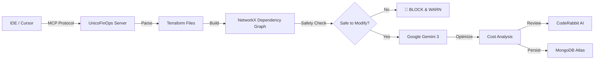

# UnicoFinOps: The Context-Aware Cloud Cost Agent 🛡️💰


> **The Problem:** Standard AI coding agents are dangerous for Infrastructure-as-Code. They suggest deleting "idle" resources without understanding hidden dependencies, leading to production outages.
>
> **The Solution:** UnicoFinOps is an **MCP Server** that builds a real-time **Dependency Graph** of your infrastructure. It blocks dangerous operations *before* they happen, then uses **Google Gemini 3** to architect rightsizing strategies that save ~90% of spend safely.

---

## 🏗️ Architecture

This project was built during the **Cerebral Valley AIE Code Agents Hackathon (NYC 2025)** using a Multi-Agent architecture:



🚀 Key Features
1. 🛡️ Graph-Based Safety Gate (NetworkX)

    Unlike "text-based" agents, UnicoFinOps builds a directed graph of your AWS resources.

* Capability: Detects attached volumes, security group references, and IAM role dependencies.
* Result: Explicitly BLOCKS DELETE operations if a downstream resource depends on the target.

2. 🧠 Bleeding-Edge Reasoning (Google Gemini 3 Preview)

    Leverages the massive context window and reasoning capabilities of Gemini 3.
* Capability: Analyzes full tfstate context to identify "Zombie Infrastructure."
* Result: Identifies gp2 vs gp3 inefficiencies and rightsizes t3.2xlarge to t3.medium based on actual CloudWatch metrics.
3. 🤝 Collaborative Governance (CodeRabbit)

We treat AI as a partner, not just a tool.

* Workflow: The Agent opens a Pull Request -> CodeRabbit reviews the code for security/compliance -> Human merges.
* Validation: CodeRabbit enforces production standards (error handling, retries) before deployment.

4. 💾 State Awareness (MongoDB Atlas)

* Uses MongoDB to maintain a history of optimizations, preventing the agent from "flapping" (suggesting the same fix twice).

---
🛠️ Tech Stack & Sponsors

* Model: Google Gemini 3 Preview (gemini-3-pro-preview)
* Protocol: Model Context Protocol (MCP) fastmcp
* Database: MongoDB Atlas (Python Driver)
* CI/CD: CodeRabbit AI
* Infrastructure: Terraform / AWS
* Language: Python 3.12 (FastAPI)

---

⚡ Quick Start

**Prerequisites**
* Python 3.12+
* Google Gemini API Key
* MongoDB Atlas URI

**Installation**

**1. Clone the Repo**
```Bash
git clone https://github.com/BorisQuanLi/unico-finops-mcp.git
cd unico-finops-mcp
```
**2. Install Dependencies**
```Bash
python3 -m venv venv
source venv/bin/activate
python3 -m pip install -r requirements.txt
```
**3.Configure Environment**
**Create a `.env` file:**
```Ini
GEMINI_API_KEY=your_key_here
MONGODB_URI=your_mongo_uri
```
**4. Run the Demo**
Run the simulation script to see the Graph Safety Guard in action:
```Bash
./venv/bin/python3 test_demo.py
```
> **Note:** We use `./venv/bin/python3` to ensure we are using the Python 3 interpreter from our virtual environment, which has the correct dependencies installed. Some system configurations may not automatically use the virtual environment's Python even when it's activated.

---
📜 License
This project is open-source under the Apache 2.0 License.
```Code
### 🚀 Commit & Push

Run these commands to update the repo immediately:

```bash
git add README.md
git commit -m "docs: update README with architecture, graph safety logic, and sponsor details"
git push
```

